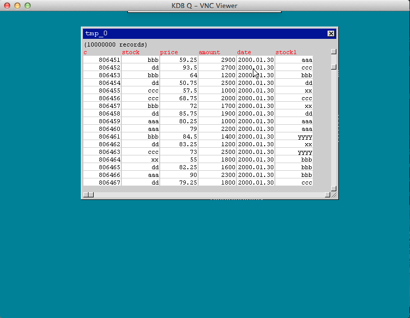

Q VNC server

This is a [Q](http://www.kx.com) implementation of a minimal vnc server.  It uses a thin java gateway to "peel" the q headers on/off of the socket connection bewteen q and the vnc client.  Absolutely all rendering happens in Q including masking of fonts and drawing the pointer.  Pieces of images are proxied through to the vnc client while events from the client are sent to and handled by Q.  The screenshot below shows a window holding a table control looking at the Q defacto trade table example random data.  To build much of the gui code rendering structure a simple object system was devised (see o.q).  

to try it out

install the [free version of Q](http://kx.com/software-download.php) from kx systems

install [RealVNC](http://www.realvnc.com/download/viewer/) client for your platform

unzip these contents into a directory 
~/vnc  
	or 
c:\vnc is good 
 
on windows 
run  
kdbvnc.bat 

on linux/OSX 
q vnc.q -p 5001 
java -classpath vnc.jar vnc.KDBVNC 
 
run the vnc client, setting the server value to "localhost"

